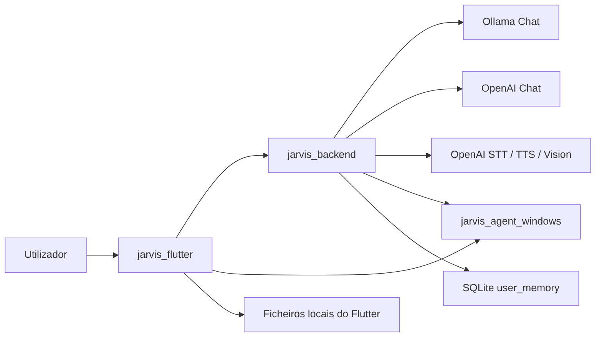

# Manual De Continuidade Do Projeto Jarvis

Estado observado no workspace em 2026-05-24.

## Atualizacao 2026-05-24

Desde a versao descrita abaixo, o produto passou a refletir estas decisoes novas de configuracao e navegacao:

- o chat deixou de depender sempre do Ollama; cada conta pode escolher `ollama` ou `openai`
- a selecao do modelo OpenAI na app passou a ser feita por lista fixa
- a chave OpenAI deixou de ser configurada no Flutter
- o backend deve usar `OPENAI_API_KEY` como fonte principal da chave
- o cliente limpa chaves OpenAI antigas guardadas por utilizador ao gravar configuracoes
- quando o Home Assistant esta desligado, a secao de dispositivos Home Assistant desaparece da navegacao da app

Impacto pratico:

1. A arquitetura atual de LLM e configuravel por conta, e nao fixa por projeto.
2. O Flutter continua a mostrar configuracao de Home Assistant, mas ja nao mostra os menus dessa area quando a integracao esta desligada.
3. A documentacao antiga que dizia "a conversa passa por modelo local" deve ser lida como historica.

## Atualizacao 2026-05-02

Desde a versao descrita abaixo, o projeto passou a ter estas alteracoes estruturais importantes:

- autenticacao por utilizador no backend
- login persistente no Flutter
- registo com verificacao por email
- recuperacao de palavra-passe por email
- separacao de dados por conta para settings, memoria, rotinas, Home Assistant e dispositivos
- logout rapido no menu lateral da app

Impacto pratico:

1. O Flutter deixou de depender apenas de `JARVIS_API_TOKEN` para uso normal.
2. A app abre agora num ecrã de login e guarda a sessao em `jarvis_auth.json`.
3. O backend envia emails transacionais por SMTP quando isso estiver configurado em `.env`.
4. Contas nao verificadas nao conseguem entrar.
5. Ao repor a palavra-passe, as sessoes antigas da conta ficam invalidadas.

Novas variaveis relevantes no backend:

- `JARVIS_APP_NAME`
- `JARVIS_SMTP_HOST`
- `JARVIS_SMTP_PORT`
- `JARVIS_SMTP_USERNAME`
- `JARVIS_SMTP_PASSWORD`
- `JARVIS_SMTP_FROM_EMAIL`
- `JARVIS_SMTP_FROM_NAME`
- `JARVIS_SMTP_USE_TLS`

Novos endpoints de autenticacao:

- `POST /auth/register`
- `POST /auth/verify-email`
- `POST /auth/resend-verification`
- `POST /auth/login`
- `POST /auth/forgot-password`
- `POST /auth/reset-password`
- `GET /auth/me`
- `POST /auth/logout`

Novos ficheiros principais introduzidos:

- `jarvis_backend/auth_store.py`
- `jarvis_backend/email_service.py`
- `jarvis_flutter/lib/services/auth_service.dart`
- `jarvis_flutter/lib/screens/login_screen.dart`
- `jarvis_flutter/lib/models/auth_models.dart`

Para operacao atual, considera esta atualizacao como a fonte de verdade para autenticacao e conta, mesmo que algumas secoes antigas mais abaixo descrevam a versao anterior.

Este manual foi escrito a partir da leitura direta do codigo existente. O objetivo e permitir que uma pessoa nova entre no projeto, perceba a arquitetura, saiba onde cada responsabilidade vive e consiga continuar a evolucao sem ter de reconstruir tudo do zero.

## 1. O que este projeto e

O workspace esta dividido em tres modulos principais:

- `jarvis_backend`: backend FastAPI que orquestra o assistente, gere sessoes, memoria, STT, TTS, ferramentas e chamadas ao LLM.
- `jarvis_agent_windows`: agente FastAPI local para Windows que executa automacoes do desktop, faz captura de ecra e gere wake word no proprio PC.
- `jarvis_flutter`: cliente Flutter com modo voz, modo chat, memoria, historico, logs e configuracoes.

Em termos funcionais, o sistema usa hoje dois tipos de motores de IA:

- chat: `Ollama` ou `OpenAI`, conforme a configuracao da conta
- voz e visao: `OpenAI` para transcricao, sintese e analise visual

Ou seja: a voz e a visao continuam dependentes da OpenAI, mas o chat ja nao e obrigatoriamente local.

## 2. Arquitetura em alto nivel



Leitura pratica do diagrama:

1. O utilizador fala ou escreve na app Flutter.
2. O Flutter envia pedidos ao backend.
3. O backend decide se responde diretamente, se chama o LLM ou se usa uma tool.
4. Quando a acao e de desktop, ela pode ser devolvida ao Flutter como `client_action` e depois executada no `jarvis_agent_windows`.
5. A memoria persistente do assistente fica no backend em SQLite.
6. O Flutter guarda localmente algumas configuracoes e o historico de atividade.

## 3. Estrutura do workspace

```text
jarvis_project/
  README.md
  MANUAL_DE_CONTINUIDADE.md
  memory.db
  tmp_test.txt
  jarvis_backend/
    README.md
    requirements.txt
    main.py
    config.py
    logging_utils.py
    inspect_memory.py
    select_voice.py
    test_audio.py
    api/
    assistant/
    audio/
    llm/
    memory/
    prompts/
    tools/
    tests/
  jarvis_agent_windows/
    README.md
    requirements.txt
    agent.py
    windows.zip
    .venv/ e venv/ (artefactos locais, nao sao parte do produto)
  jarvis_flutter/
    README.md
    pubspec.yaml
    pubspec.lock
    analysis_options.yaml
    lib/
      config/
      models/
      screens/
      services/
      widgets/
    test/
    android/
    ios/
    linux/
    macos/
    windows/
    web/
    assets/
```

Notas importantes sobre a estrutura:

- `memory.db` na raiz do workspace nao e o caminho default usado pelo backend atual. O backend aponta por defeito para `jarvis_backend/memory.db`, a menos que `JARVIS_DB_FILE` seja definido.
- `tmp_test.txt` parece artefacto temporario.
- Dentro de `jarvis_agent_windows` existem `.venv/`, `venv/` e `__pycache__/`; isso e ambiente local, nao arquitetura do produto.

## 4. Ordem de arranque e dependencias

Ordem normal de arranque:

1. `jarvis_backend`
2. `jarvis_agent_windows`
3. `jarvis_flutter`

Dependencias externas reais:

- Python 3.11+
- Flutter SDK
- Ollama a correr apenas se quiseres usar o provedor local
- `OPENAI_API_KEY` para STT, TTS, visao e opcionalmente chat OpenAI
- Windows para o agente local

Variaveis mais importantes no backend:

- `OPENAI_API_KEY`
- `JARVIS_API_TOKEN`
- `JARVIS_OLLAMA_URL`
- `JARVIS_OLLAMA_MODEL`
- `JARVIS_OPENAI_CHAT_MODEL`
- `JARVIS_LLM_TIMEOUT_SECONDS`
- `JARVIS_DESKTOP_AGENT_URL`

Variaveis mais importantes no Flutter via `--dart-define`:

- `JARVIS_API_BASE_URL`
- `JARVIS_AGENT_BASE_URL`
- `JARVIS_API_TOKEN`

## 5. Fluxos principais do sistema

### 5.1 Fluxo de chat por texto

1. O Flutter cria sessao com `POST /sessions`.
2. O utilizador escreve na `ChatScreen`.
3. `ApiService.sendMessage()` envia `session_id` e `message` para `POST /chat`.
4. `AssistantService.chat()` processa a mensagem.
5. O backend pode:
   - responder diretamente;
   - executar uma tool do lado do backend;
   - devolver uma `client_action` para o Flutter executar no dispositivo.
6. O Flutter apresenta a resposta, atualiza memoria e grava historico local de atividade.

### 5.2 Fluxo de voz

1. O utilizador toca no microfone, ou a wake word dispara uma captura.
2. `VoiceService` grava audio com VAD local no Flutter.
3. O Flutter envia um WAV para `POST /voice/turn`.
4. O backend transcreve o audio com OpenAI.
5. O backend chama `AssistantService.chat()` com o texto transcrito.
6. O backend devolve `reply`, `transcript`, e opcionalmente `tool_call`, `tool_result` ou `client_action`.
7. O Flutter executa a `client_action` se existir, atualiza historico/memoria e chama `/tts`.
8. O backend sintetiza MP3 em base64 e o Flutter reproduz o audio.

### 5.3 Fluxo de wake word no Windows

1. `AssistantRuntimeService` pede ao `WakeWordService` para iniciar escuta.
2. `WakeWordService` chama `jarvis_agent_windows` em `/wake-word/start`.
3. O agente arranca uma thread de wake word com:
   - `sounddevice`
   - `silero_vad`
   - `faster-whisper`
   - heuristicas foneticas/fuzzy
4. Quando a palavra e detetada, o agente publica um evento em memoria.
5. O Flutter faz polling a `/wake-word/events/next`.
6. Ao receber `wake_word_detected`, o Flutter abre o overlay ou o modo voz e comeca a capturar fala.

### 5.4 Fluxo de memoria

1. O backend extrai heuristicas simples da fala do utilizador em `memory/extract.py`.
2. `memory/user_memory.py` grava entradas em SQLite.
3. `prompts/system_prompt.py` rele essa memoria e injeta-a no system prompt.
4. O Flutter tambem consegue ler, editar e limpar a memoria pela API.
5. Algumas configuracoes do Flutter sao espelhadas para memoria com as chaves:
   - `assistant_name`
   - `name`
   - `wake_word_phrase`

## 6. Persistencia de dados

O projeto guarda estado em quatro sitios diferentes:

- Backend SQLite: `jarvis_backend/memory.db` por defeito.
- Flutter settings local: `jarvis_settings.json` na pasta de documentos da app.
- Flutter activity history local: `assistant_activity_history.json` na pasta de documentos da app.
- Logs em runtime: `LogService` guarda em memoria apenas durante a sessao atual da app.

Consequencias praticas:

- Se o backend for apagado, a memoria do assistente desaparece.
- Se a app Flutter for reinstalada, historico e settings locais podem perder-se.
- Os logs da UI nao sobrevivem ao reinicio da app.

## 7. Modulo `jarvis_backend`

### 7.1 Papel do backend

O backend e o cerebro central do sistema. Ele:

- expoe a API HTTP;
- cria e mantem sessoes de conversa;
- monta o system prompt;
- chama o LLM;
- decide e executa tools;
- gere memoria persistente;
- faz STT, TTS e visao.

### 7.2 Ficheiros da raiz do backend

- `jarvis_backend/config.py`
  - Carrega `.env` manualmente.
  - Define a dataclass `Settings`.
  - Centraliza URLs, modelos, timeouts, DB e token.
  - Exporta constantes antigas para compatibilidade (`OLLAMA_URL`, `MODEL`, etc.).
  - Tambem expoe `STOP_TTS`, mas essa flag hoje nao esta integrada com o TTS atual por API.

- `jarvis_backend/logging_utils.py`
  - Configura logging em JSON simples.
  - `log_event()` cria um payload estruturado com timestamp, nivel, logger e campos extra.
  - E a base de logs para a API e para o cliente Ollama.

- `jarvis_backend/main.py`
  - E o ponto de entrada com dois modos: `voice` e `server`.
  - `run_server_mode()` sobe FastAPI via uvicorn.
  - `run_voice_mode()` tenta usar o assistente local com wake word, STT e TTS.
  - Atencao: o modo `voice` esta desatualizado, porque importa `speak` de `audio.tts`, mas `audio/tts.py` hoje so expoe `synthesize_speech()`.

- `jarvis_backend/inspect_memory.py`
  - Script manual para inspecionar uma base SQLite.
  - Parece legado: usa `jarvis_memory.db`, nao o caminho default real definido em `config.py`.
  - Serve para diagnostico, nao faz parte da runtime atual.

- `jarvis_backend/select_voice.py`
  - Script de utilidade para testar vozes locais via `pyttsx3`.
  - Nao esta ligado ao TTS atual do backend, que usa OpenAI.
  - Serve mais como ferramenta historica/experimental.

- `jarvis_backend/test_audio.py`
  - Script muito simples para gravar `teste.wav`.
  - Nao faz parte da API nem da app.

- `jarvis_backend/requirements.txt`
  - Lista dependencias principais do backend.
  - Algumas dependencias usadas em scripts auxiliares nao estao aqui, como `simpleaudio`, `scipy` e `pyttsx3`.

### 7.3 Pacote `api/`

- `jarvis_backend/api/__init__.py`
  - Apenas marca o pacote.

- `jarvis_backend/api/schemas.py`
  - Modelos Pydantic da API.
  - `ChatRequest`: `session_id` + `message`.
  - `SessionResponse`: devolve `session_id`, tools e flag de desktop tools.
  - `ChatResponse`: resposta base do chat, com `tool_call`, `tool_result` e `client_action`.
  - `VoiceTurnResponse`: herda de `ChatResponse` e acrescenta `transcript`, `platform`, `locale`.
  - `MemoryEntryResponse` e `MemoryUpdateRequest`: contrato da memoria.

- `jarvis_backend/api/server.py`
  - Monta o FastAPI app.
  - Configura logging via `configure_logging(settings.log_level)`.
  - Cria uma unica instancia de `AssistantService(enable_desktop_tools=False)`.
  - Em modo API, o backend nao deve carregar automacoes locais invasivas; por isso devolve `client_action` para o Flutter/agent.
  - `require_api_token()` valida Bearer token quando `JARVIS_API_TOKEN` esta configurado.
  - `request_logging_middleware()` gera `X-Request-ID`, mede duracao e regista cada pedido.
  - Endpoints:
    - `GET /health`: estado simples e se a auth esta ativa.
    - `POST /sessions`: cria sessao.
    - `DELETE /sessions/{session_id}`: apaga sessao em memoria.
    - `POST /chat`: executa um turno de chat.
    - `GET /memory`, `PUT /memory/{key}`, `DELETE /memory/{key}`, `DELETE /memory`: CRUD da memoria.
    - `POST /transcribe`: STT puro para um ficheiro WAV.
    - `POST /voice/turn`: STT + chat numa so chamada.
    - `POST /tts`: devolve MP3 em base64.
  - `_transcribe_file()` usa OpenAI com `OPENAI_TRANSCRIPTION_MODEL`.
  - `_delete_temp_file()` limpa WAVs temporarios.

### 7.4 Pacote `assistant/`

- `jarvis_backend/assistant/__init__.py`
  - Apenas marca o pacote.

- `jarvis_backend/assistant/service.py`
  - E o ficheiro mais importante do backend.
  - Contem:
    - normalizacao de texto;
    - respostas rapidas de hora/data/dia;
    - heuristicas para limpar memoria, fechar aba, fechar janela e pesquisar no YouTube;
    - conversao de tool call do LLM em `client_action`;
    - estado de sessao;
    - orquestracao do chat inteiro.
  - Helpers relevantes:
    - `normalize_text()`: remove acentos e normaliza texto para comparacoes.
    - `build_time_reply()`, `build_date_reply()`, `build_weekday_reply()`: respostas deterministicas sem LLM.
    - `matches_memory_clear_command()`: identifica comandos de limpeza de memoria.
    - `matches_close_window_command()` e `matches_close_tab_command()`: atalhos sem LLM.
    - `extract_youtube_query()`: tenta extrair musica/video a abrir no YouTube.
    - `build_client_action()`: traduz um `tool_call` em contrato simples para o Flutter.
  - `SessionState`
    - Guarda `messages` da conversa e um `Lock` por sessao.
  - `AssistantService`
    - `__init__()`: ativa/desativa desktop tools e inicializa a DB.
    - `create_session()`: cria `session_id`, injecta system prompt e guarda sessao em memoria.
    - `delete_session()`: remove sessao.
    - `_get_session_state()`: valida se a sessao existe.
    - `chat()`: processa um turno completo.
  - Fluxo interno de `chat()`:
    1. valida mensagem;
    2. aplica atalhos deterministas (hora/data/memoria/tempo/close tab/window/YouTube/screenshot/volume);
    3. adiciona a mensagem do utilizador ao historico;
    4. extrai factos simples para memoria;
    5. reconstroi o system prompt com memoria atual;
    6. chama `call_llm()`;
    7. tenta interpretar a resposta como `tool_call`;
    8. se for tool:
       - ou converte para `client_action`;
       - ou executa no backend com `execute_tool()`;
    9. guarda resposta final e trunca historico para `MAX_TURNS`.
  - Observacao importante:
    - o backend usa um misto de regras duras e LLM. Nem tudo passa pelo modelo.

### 7.5 Pacote `audio/`

- `jarvis_backend/audio/signals.py`
  - Toca um beep curto com `simpleaudio`.
  - Pertence ao modo local antigo.

- `jarvis_backend/audio/stt.py`
  - Grava audio pelo microfone com `sounddevice`.
  - Usa `webrtcvad` para detetar voz.
  - Converte o audio temporario para WAV.
  - Chama OpenAI para transcrever.
  - Este ficheiro serve o modo local CLI, nao o endpoint `/voice/turn`.

- `jarvis_backend/audio/tts.py`
  - TTS atual do backend.
  - Usa OpenAI e devolve MP3 em base64.
  - `synthesize_speech(text)` e a funcao consumida pela API `/tts`.
  - Nao faz reproducao local.

- `jarvis_backend/audio/wakeword.py`
  - Implementacao antiga/local de wake word.
  - Usa `sounddevice`, `silero_vad`, `faster-whisper` e `rapidfuzz`.
  - Escuta a palavra "jarvis" localmente.
  - Serve o caminho CLI legado, nao a arquitetura principal Flutter + agent.

### 7.6 Pacote `llm/`

- `jarvis_backend/llm/ollama.py`
  - Cliente HTTP simples para o endpoint `/api/chat` do Ollama.
  - Monta payload com `MODEL`, `temperature` e `top_p`.
  - Se Ollama falhar, levanta `LLMUnavailableError`.
  - Faz logging estruturado da indisponibilidade e do tamanho da resposta.

- `jarvis_backend/llm/openai.py`
  - Cliente do chat OpenAI para o backend.
  - Usa a chave configurada por ambiente ou pelo store de settings.
  - Serve o caminho em que `llm_provider = openai`.

- `jarvis_backend/llm/service.py`
  - Dispatcher de LLM.
  - Decide se o turno de chat segue para `ollama.py` ou `openai.py`.
  - Centraliza a escolha por provider/modelo.

### 7.7 Pacote `memory/`

- `jarvis_backend/memory/extract.py`
  - Heuristicas simples de NLP.
  - Extrai nome, preferencias e lembretes de frases comuns.
  - Chama `save_fact()`, `save_preference()` e `save_reminder()`.
  - Nao usa LLM; e regex pura.

- `jarvis_backend/memory/user_memory.py`
  - Implementacao SQLite da memoria persistente.
  - Responsabilidades:
    - abrir ligacao;
    - criar tabela `user_memory`;
    - guardar factos;
    - gerar indices para preferencias e lembretes;
    - listar memoria em formato amigavel para a UI;
    - editar e limpar memoria.
  - Convencoes de chaves:
    - factos simples: `name`, `assistant_name`, `wake_word_phrase`, etc.
    - preferencias: `preference_1`, `preference_2`, ...
    - lembretes: `reminder_1`, `reminder_2`, ...
  - `list_memory_entries()` ordena por tipo e indice para a tabela da UI.

### 7.8 Pacote `prompts/`

- `jarvis_backend/prompts/system_prompt.py`
  - Define `BASE_SYSTEM_PROMPT`.
  - Injeta:
    - nome do assistente;
    - wake word atual;
    - nome do utilizador;
    - preferencias;
    - lembretes;
    - tools disponiveis.
  - O LLM recebe este prompt a cada sessao, e o prompt pode ser regenerado quando a memoria muda.

### 7.9 Pacote `tools/`

- `jarvis_backend/tools/schemas.py`
  - Helper minimo: `tool_result(name, ok, data)`.

- `jarvis_backend/tools/registry.py`
  - Define a lista de tools que o LLM pode ver.
  - `TOOLS` inclui:
    - `get_weather`
    - `search_web`
    - `open_website`
    - `open_app`
    - `control_computer`
    - `analyze_screen`
    - `type_text`
    - `press_keys`
  - `LOCAL_AUTOMATION_TOOL_NAMES` marca tools mais locais/invasivas.
  - `available_tools(enable_local_automation=False)` esconde `type_text` e `press_keys` em modo API.
  - Nota: `control_computer` continua visivel em modo API porque pode ser convertido em `client_action`.

- `jarvis_backend/tools/executor.py`
  - Faz duas coisas:
    - interpreta tool calls recebidas em texto/JSON;
    - executa a tool concreta.
  - `extract_tool_call()` tenta encontrar JSON valido mesmo que venha misturado com texto.
  - `execute_tool()` encaminha para weather, web, desktop, screen, etc.
  - `parse_day()` converte expressoes como `hoje`, `amanha`, `sexta` em `day_offset`.

- `jarvis_backend/tools/weather.py`
  - Consulta Open-Meteo.
  - Trabalha com um dicionario pequeno de cidades conhecidas.
  - So devolve max/min, em linguagem natural.
  - Se a cidade nao existir na tabela local, cai em `Lisboa`.

- `jarvis_backend/tools/web_search.py`
  - Usa `duckduckgo-search`.
  - Junta ate 5 resultados em texto corrido com titulo, resumo e fonte.

- `jarvis_backend/tools/desktop.py`
  - Implementa automacoes desktop locais do lado do backend.
  - Tem mapa de apps conhecidas e sites conhecidos.
  - Operacoes:
    - abrir site
    - abrir app
    - fechar janela
    - fechar app
    - ativar janela
    - minimizar janela
    - escrever texto
    - premir teclas
    - pesquisar no YouTube
    - `control_computer()` como router de alto nivel
  - Esta logica e muito parecida com a do agente Windows, o que cria duplicacao arquitetural.

- `jarvis_backend/tools/screen.py`
  - Captura o ecra via agent Windows se possivel.
  - Se o agent falhar, tenta captura local com `pyautogui`.
  - Envia a imagem para o modelo de visao da OpenAI.
  - Responde em portugues e pode incluir o titulo da janela ativa.

### 7.10 Testes do backend

- `jarvis_backend/tests/test_api_server.py`
  - Valida auth, health, create session, chat e `/tts`.

- `jarvis_backend/tests/test_executor.py`
  - Testa `parse_day()` com datas relativas e dias da semana.

- `jarvis_backend/tests/test_registry.py`
  - Garante que o modo API esconde as tools de teclado local.

- `jarvis_backend/tests/test_service_helpers.py`
  - Testa:
    - inferencia de `client_action`
    - deteccao de comandos de fechar aba/janela
    - extracao de query do YouTube
    - limpeza de memoria

- `jarvis_backend/tests/test_system_prompt.py`
  - Confirma que o system prompt usa nome do assistente, wake word, nome do utilizador, preferencias e lembretes.

Estado atual dos testes:

- Em 2026-04-18 executei `python -B -m unittest discover -s tests -v` dentro de `jarvis_backend`.
- Resultado: 18 testes, todos a passar.

## 8. Modulo `jarvis_agent_windows`

### 8.1 Papel do agente

O agente Windows executa acoes que precisam de correr no proprio desktop controlado:

- abrir apps e URLs;
- escrever texto e atalhos;
- mudar ou fechar janelas;
- tirar screenshot;
- ouvir wake word localmente;
- fornecer captura do ecra ao backend.

### 8.2 Ficheiro principal

- `jarvis_agent_windows/agent.py`
  - Contem toda a implementacao do agente.
  - Divide-se em quatro blocos grandes:
    1. utilitarios de desktop;
    2. logica de wake word;
    3. executor de acoes;
    4. endpoints FastAPI.

Bloco 1: utilitarios desktop

- `KNOWN_APPS` e `KNOWN_WEBSITES`: mapas de conveniencia.
- `_normalize_lookup()` e `_fold_text()`: normalizacao para matching tolerante.
- `_find_windows()`: procura janelas por titulo.
- `_capture_screen_payload()`: faz screenshot e devolve PNG em base64.
- `_close_window()` e `_close_app()`: encerram janelas/processos, protegendo nomes como `jarvis`, `codex`, `flutter`.
- `_search_youtube()`: abre resultado de pesquisa no browser.

Bloco 2: wake word

- Estado global:
  - `_WAKE_WORD_EVENTS`
  - `_WAKE_WORD_LOCK`
  - `_WAKE_WORD_STOP`
  - `_WAKE_WORD_THREAD`
  - `_CURRENT_WAKE_WORD_PHRASE`
- `_load_wake_word_runtime()`
  - Importa dependencias opcionais so em runtime.
  - Carrega `WhisperModel('tiny')` e o modelo `silero_vad`.
- `_matches_wake_word_candidate()`
  - Faz matching tolerante com:
    - forma fonetica simplificada;
    - substring;
    - distancia de Levenshtein.
- `_contains_wake_word()`
  - Procura a wake word em texto inteiro, palavras individuais e combinacoes de palavras vizinhas.
- `_wait_for_wake_word()`
  - Escuta audio, corre VAD e transcricao local.
  - Publica eventos `wake_word_heard`.
  - Quando deteta, devolve dados com score e transcript.
- `_wake_word_loop()`
  - Corre em thread daemon.
  - Publica `wake_word_detected` ou `wake_word_error`.

Bloco 3: acoes

- `_run_action(data)`
  - Router de alto nivel para:
    - `volume_up`
    - `volume_down`
    - `close_window`
    - `close_tab`
    - `close_app`
    - `screenshot`
    - `list_processes`
    - `open_url`
    - `open_app`
    - `type_text`
    - `press_keys`
    - `youtube_search`
    - `activate_window`
    - `minimize_window`

Bloco 4: API

- `GET /health`
  - Informa se a wake word esta a correr, engine, erro e keyword atual.

- `POST /wake-word/start`
  - Define a wake word e arranca a thread se necessario.

- `POST /wake-word/stop`
  - Para a thread de wake word.

- `GET /wake-word/events/next`
  - Faz blocking poll curto sobre a queue interna.

- `GET /screen/capture`
  - Devolve screenshot atual para o backend poder fazer visao.

- `POST /action`
  - Executa uma acao de desktop recebida do Flutter.

### 8.3 Ficheiros auxiliares

- `jarvis_agent_windows/README.md`
  - Explica como arrancar o agente.

- `jarvis_agent_windows/requirements.txt`
  - Dependencias do agente.

### 8.4 Observacoes arquiteturais

- O agente concentra toda a logica num unico ficheiro. Funciona, mas dificulta manutencao a medio prazo.
- Existe duplicacao com `jarvis_backend/tools/desktop.py`.
- O mecanismo de eventos da wake word e todo em memoria; se o processo cair, o estado perde-se.

## 9. Modulo `jarvis_flutter`

### 9.1 Papel da app Flutter

O Flutter e a interface operacional do assistente. Ele:

- apresenta o modo voz e o modo chat;
- faz captura local de audio com VAD;
- envia audio/texto para o backend;
- reproduz TTS devolvido pelo backend;
- executa `client_action` no dispositivo;
- mostra memoria, historico, logs e configuracoes;
- coordena tray e overlay no desktop.

### 9.2 Ficheiros de raiz

- `jarvis_flutter/pubspec.yaml`
  - Define dependencias como `http`, `record`, `vad`, `audioplayers`, `window_manager`, `tray_manager`, `url_launcher`.
  - Ainda tem a descricao placeholder `"A new Flutter project."`.

- `jarvis_flutter/analysis_options.yaml`
  - Configuracao de analise estatica do Flutter.

- `jarvis_flutter/lib/main.dart`
  - Entry point da app.
  - Inicializa `window_manager` em desktop.
  - Cria `MyApp`.
  - Liga o `title` da app ao nome do assistente vindo de `AppSettingsService`.

### 9.3 `lib/config/`

- `jarvis_flutter/lib/config/app_endpoints.dart`
  - Le `dart-define` para URLs e token.
  - Gera headers HTTP.
  - Tambem produz mensagens de erro amigaveis quando a app tenta falar com `127.0.0.1` a partir de telemovel/emulador.

### 9.4 `lib/models/`

- `assistant_state.dart`
  - Enum visual e funcional do assistente: `idle`, `listening`, `thinking`, `speaking`.

- `chat_message.dart`
  - Modelo minimo para bolhas de chat: texto + flag se veio do utilizador.

- `chat_response.dart`
  - Modelos do protocolo de resposta do backend:
    - `ClientAction`
    - `ToolCallModel`
    - `ToolResultModel`
    - `ChatResponseModel`
  - E a tradutora entre JSON do backend e objetos Dart.

- `log_entry.dart`
  - Modelo de log local da UI.

- `memory_entry.dart`
  - Modelo da memoria devolvida pelo backend.

- `activity_history_entry.dart`
  - Modelo do historico local de acoes executadas pelo assistente.
  - Tem `toJson()` e `fromJson()` para persistencia em ficheiro.

### 9.5 `lib/services/`

- `api_service.dart`
  - Cliente HTTP do backend.
  - Responsavel por:
    - criar sessao;
    - enviar texto para `/chat`;
    - enviar audio para `/voice/turn`;
    - ler e alterar memoria;
    - guardar settings, incluindo provider LLM e configuracao Home Assistant.
  - Converte timeouts e erros de ligacao em mensagens mais legiveis.

- `agent_service.dart`
  - Cliente HTTP do `jarvis_agent_windows`.
  - Implementa:
    - `sendPcAction()`
    - `startWakeWord()`
    - `stopWakeWord()`
    - `nextWakeWordEvent()`
    - `getHealth()`
  - Tambem define os modelos de resposta do agent.

- `app_settings_service.dart`
  - Service singleton para nome do assistente, nome do utilizador, wake word, LLM, audio local e Home Assistant.
  - Persiste localmente em `jarvis_settings.json`.
  - Tenta sincronizar essas informacoes com a memoria/settings do backend.
  - Passou a gerir:
    - `llm_provider`
    - `ollama_url`
    - `ollama_model`
    - `openai_model`
    - `home_assistant_enabled`
  - A chave OpenAI deixou de ser configurada no UI; ao guardar, o cliente envia `openai_api_key` vazio para limpar restos antigos.
  - Continua a espelhar informacoes basicas nas chaves:
    - `assistant_name`
    - `name`
    - `wake_word_phrase`
  - Tem dois modos de erro:
    - `error`: falha geral;
    - `warning`: gravou localmente mas nao conseguiu sincronizar tudo.

- `memory_service.dart`
  - Singleton que carrega e atualiza a memoria via API.
  - Mantem cache local em memoria.
  - Escreve logs no `LogService`.

- `log_service.dart`
  - Singleton de logs da UI.
  - Mantem a lista de logs so em memoria.
  - Serve as tabelas de logs na interface.

- `activity_history_service.dart`
  - Singleton que grava historico local das acoes do assistente.
  - Persiste em `assistant_activity_history.json`.
  - Regista separadamente:
    - tools backend;
    - acoes cliente (abrir app/site, desktop action).
  - O historico nao vem do backend; e reconstruido no cliente.

- `assistant_runtime_service.dart`
  - Coordenador do runtime de wake word.
  - Mantem:
    - se a wake word esta ativada;
    - se esta pronta;
    - se ha captura de voz a decorrer.
  - Quando a wake word dispara, usa `AppShellService` para pedir abertura do modo voz.

- `app_shell_service.dart`
  - Pequeno event bus interno da UI.
  - Usa tokens inteiros para notificar:
    - wake prompt
    - inicio de captura de voz
    - dismiss do overlay
  - Tambem gere se a app esta em `voiceOverlayMode`.

- `voice_service.dart`
  - Implementa captura de voz local no Flutter com o package `vad`.
  - Cria WAV com `WavAudioService`.
  - Expoe:
    - `captureSpeechTurn()`
    - `finishCapture()`
    - `cancelCapture()`
  - E a base real da experiencia de voz no cliente.

- `wav_audio_service.dart`
  - Escreve manualmente o header WAV e o PCM16.
  - Recebe `List<double>` e devolve `Uint8List`.

- `tts_service.dart`
  - Chama `POST /tts` no backend.
  - Recebe MP3 em base64.
  - Reproduz o audio com `audioplayers`.
  - Escreve logs no `LogService`.

- `wake_word_service.dart`
  - Camada cliente sobre o `AgentService` para wake word.
  - Arranca escuta no agent, faz polling dos eventos e chama callback quando a wake word e detetada.
  - So e usada em Windows.

- `audio_signal_service.dart`
  - Utilitario para analisar WAV localmente.
  - Mede RMS, pico e ratio de atividade.
  - Hoje nao e uma peca central do fluxo principal, mas pode servir para diagnostico/validacao futura.

### 9.6 `lib/screens/`

- `app_shell.dart`
  - Shell principal da app.
  - Define `AppSection` com:
    - `voice`
    - `chat`
    - `devices`
    - `routines`
    - `memory`
    - `history`
    - `logs`
    - `settings`
  - Responsabilidades:
    - inicializar tray e `window_manager` no desktop;
    - decidir que ecra esta visivel;
    - gerir modo normal vs overlay de voz;
    - esconder para tray em vez de fechar;
    - mostrar banner de wake prompt.
  - A lista real de secoes visiveis passou a ser dinamica:
    - `devices` so aparece quando `homeAssistantEnabled` esta ativo
    - se o utilizador desligar Home Assistant enquanto estiver nessa secao, a app volta para `voice`
  - E o centro de navegacao da UI.

- `voice_assistant_screen.dart`
  - Interface principal do modo voz.
  - Responsabilidades:
    - criar sessao;
    - ouvir toques do utilizador;
    - reagir aos tokens do `AppShellService`;
    - capturar audio com `VoiceService`;
    - enviar audio ao backend;
    - reproduzir TTS;
    - executar `client_action`;
    - atualizar memoria;
    - gravar historico de atividade.
  - Metodos mais importantes:
    - `_ensureSession()`
    - `_startListening()`
    - `_captureAndProcessSpeech()`
    - `_runPostResponseTasks()`
    - `_handleClientAction()`
    - `_recordResponseHistory()`
    - `_buildMainUI()`
    - `_buildWakeWordOverlay()`
  - Esta screen mistura logica de aplicacao e UI; e uma das melhores candidatas a refactor futuro.

- `chat_screen.dart`
  - Equivalente textual do modo voz.
  - Mantem lista de `ChatMessage`.
  - Cria sessao, envia texto, pode capturar voz manualmente, executa `client_action` e regista historico.
  - Tem duplicacao parcial com `voice_assistant_screen.dart`, sobretudo na execucao de `client_action` e no registo de historico.
  - Tambem tenta abrir apps em Android e iOS via intents/schemes, com fallback para pesquisa web.

- `assistant_memory_screen.dart`
  - Ecran wrapper que apresenta titulo/hero e embebe `MemoryPanel`.

- `activity_history_screen.dart`
  - Ecran wrapper para `ActivityHistoryPanel`.

- `system_logs_screen.dart`
  - Ecran wrapper para `LogPanel`.

- `settings_screen.dart`
  - UI para editar:
    - nome do assistente;
    - nome do utilizador;
    - wake word;
    - LLM (`Ollama` ou `OpenAI`);
    - modelo OpenAI por lista fixa;
    - configuracao do Ollama;
    - microfone;
    - TTS;
    - dispositivos;
    - Home Assistant;
    - limpeza da memoria.
  - Trabalha por cima de `AppSettingsService`.
  - Mostra feedback por `SnackBar`.

### 9.7 `lib/widgets/`

- `jarvis_orb.dart`
  - Widget visual principal do modo voz.
  - Mostra uma orb animada que muda cor, brilho e label consoante `AssistantState`.

- `hud_background.dart`
  - Pinta grelha e linhas HUD para o fundo do modo voz.

- `particles.dart`
  - Pinta particulas animadas por cima do fundo.

- `status_panels.dart`
  - Compoe `LogPanel` e `MemoryPanel`.
  - Em ecras largos mostra painel em coluna; em ecras pequenos usa tabs.

- `log_panel.dart`
  - Tabela/lista de logs locais.
  - Tem pesquisa, filtro por tipo e limpeza total.

- `memory_panel.dart`
  - Painel mais completo da memoria.
  - Faz:
    - refresh;
    - pesquisa textual;
    - filtro por tipo;
    - edicao de registo;
    - remocao de registo;
    - limpeza total;
    - tabela responsiva.

- `activity_history_panel.dart`
  - Painel do historico local.
  - Tem:
    - pesquisa;
    - filtros por categoria, origem e estado;
    - colapso/expansao de filtros em layout compacto;
    - limpeza de historico.

### 9.8 `test/`

- `jarvis_flutter/test/widget_test.dart`
  - Ainda e o teste placeholder do contador gerado pelo Flutter.
  - Nao corresponde a esta aplicacao.
  - Na pratica, deve ser tratado como divida tecnica e substituido por testes reais da UI/servicos.

### 9.9 Camadas de plataforma do Flutter

Codigo nativo relevante:

- `jarvis_flutter/android/app/src/main/AndroidManifest.xml`
  - Declara:
    - `RECORD_AUDIO`
    - `INTERNET`
    - `MODIFY_AUDIO_SETTINGS`
  - E o ficheiro nativo mais importante no Android atual.

- `jarvis_flutter/android/app/src/main/kotlin/com/example/jarvis_flutter/MainActivity.kt`
  - E um `FlutterActivity` default, sem logica extra.

- `jarvis_flutter/ios/Runner/Info.plist`
  - Declara `NSMicrophoneUsageDescription`.

- `jarvis_flutter/ios/Runner/AppDelegate.swift`
  - AppDelegate standard com registo de plugins.

- `jarvis_flutter/macos/Runner/AppDelegate.swift`
  - AppDelegate desktop standard.

- `jarvis_flutter/windows/runner/main.cpp`
  - Bootstrap standard do runner Windows.

- `jarvis_flutter/linux/runner/main.cc`
  - Bootstrap standard do runner Linux.

Ficheiros maioritariamente gerados:

- `jarvis_flutter/windows/flutter/generated_*`
- `jarvis_flutter/linux/flutter/generated_*`
- `jarvis_flutter/macos/Flutter/GeneratedPluginRegistrant.swift`
- varios `CMakeLists.txt`, `project.pbxproj`, `xcworkspace`, `Runner.rc`, etc.

Regra pratica para manutencao:

- mexe nestes ficheiros de plataforma apenas quando precisares de:
  - permissoes nativas;
  - assinaturas/build IDs;
  - integracao nativa especifica;
  - configuracao de plugins.
- para logica de produto, quase tudo vive em `lib/`.

## 10. O que e central e o que e legado

### 10.1 Caminho atual do produto

O caminho principal hoje parece ser:

- Flutter como interface principal
- Backend FastAPI como cerebro
- Agent Windows para automacao local e wake word
- Ollama ou OpenAI para conversa
- OpenAI para STT/TTS/visao

### 10.2 Caminho legado ou incompleto

Os seguintes elementos parecem ser restos de uma fase anterior ou utilitarios avulsos:

- `jarvis_backend/main.py --mode voice`
- `jarvis_backend/audio/wakeword.py`
- `jarvis_backend/audio/stt.py` como caminho CLI
- `jarvis_backend/audio/signals.py`
- `jarvis_backend/select_voice.py`
- `jarvis_backend/inspect_memory.py`
- `jarvis_backend/test_audio.py`

Isto nao significa que devam ser apagados ja. Significa apenas que quem continuar o projeto deve decidir se:

- os repara e assume como suportados;
- ou os remove/refatora para reduzir ruido.

## 11. Divida tecnica e pontos de atencao

Estas sao as inconsistencias mais importantes que encontrei ao ler o codigo:

1. `jarvis_backend/main.py` usa `speak()`, mas `jarvis_backend/audio/tts.py` ja nao expoe essa funcao.
   - O modo `voice` do backend nao esta alinhado com o TTS atual.

2. `jarvis_backend/inspect_memory.py` usa `jarvis_memory.db`, enquanto o backend atual aponta por defeito para `jarvis_backend/memory.db`.
   - O script de inspecao pode estar a olhar para a base errada.

3. Existe duplicacao entre:
   - `jarvis_backend/tools/desktop.py`
   - `jarvis_agent_windows/agent.py`
   - `jarvis_flutter` na parte de execucao de `client_action`
   - Isto aumenta o custo de manutencao e o risco de divergencia.

4. `jarvis_flutter/lib/screens/chat_screen.dart` e `jarvis_flutter/lib/screens/voice_assistant_screen.dart` repetem bastante logica.
   - Principalmente:
     - sessao
     - execucao de `client_action`
     - historico

5. `jarvis_flutter/test/widget_test.dart` ainda e um teste gerado pelo template.
   - Nao protege a aplicacao real.

6. Alguns ficheiros e metadados do Flutter ainda tem texto de template:
   - `pubspec.yaml`
   - `web/index.html`
   - `web/manifest.json`

7. Dependencias auxiliares parecem nao estar refletidas nos requirements do backend:
   - `simpleaudio`
   - `scipy`
   - `pyttsx3`
   - Isto reforca que parte dos scripts auxiliares/legados nao esta totalmente mantida.

## 12. Como continuar o projeto sem se perder

### 12.1 Se quiseres adicionar uma nova tool

Segue esta ordem:

1. Adiciona a tool em `jarvis_backend/tools/registry.py`.
2. Implementa a execucao real em:
   - `tools/executor.py`, se for backend-side;
   - `assistant/service.py` + Flutter/agent, se for `client_action`.
3. Se a acao for desktop:
   - decide se corre no backend local ou no `jarvis_agent_windows`;
   - atualiza `build_client_action()` se precisares de devolve-la ao cliente.
4. Atualiza `ActivityHistoryService` para nomes e detalhes mais claros.
5. Cria testes no backend.

### 12.2 Se quiseres adicionar uma definicao de memoria

1. Decide a chave em `memory/user_memory.py`.
2. Garante que `system_prompt.py` a injeta no prompt, se isso fizer sentido.
3. Se a UI a precisar de editar, usa a API `/memory`.
4. Se a nova memoria for configuracao da app, atualiza tambem `AppSettingsService`.

### 12.3 Se quiseres evoluir a experiencia de voz

Os pontos mais centrais sao:

- `jarvis_flutter/lib/services/voice_service.dart`
- `jarvis_flutter/lib/screens/voice_assistant_screen.dart`
- `jarvis_agent_windows/agent.py` para wake word
- `jarvis_backend/api/server.py` e `audio/tts.py` para STT/TTS

### 12.4 Se quiseres estabilizar o produto antes de adicionar features

As quatro tarefas com maior retorno parecem ser:

1. Alinhar ou remover o modo CLI de voz do backend.
2. Consolidar a logica de desktop num unico sitio.
3. Substituir o teste placeholder do Flutter por testes reais.
4. Extrair logica repetida de chat/voz para services reutilizaveis.

## 13. Leitura recomendada para onboarding tecnico

Se alguem novo entrar no projeto, a ordem ideal para ler o codigo e:

1. `README.md`
2. este manual
3. `jarvis_backend/api/server.py`
4. `jarvis_backend/assistant/service.py`
5. `jarvis_backend/prompts/system_prompt.py`
6. `jarvis_backend/tools/executor.py`
7. `jarvis_agent_windows/agent.py`
8. `jarvis_flutter/lib/screens/app_shell.dart`
9. `jarvis_flutter/lib/screens/voice_assistant_screen.dart`
10. `jarvis_flutter/lib/screens/chat_screen.dart`
11. `jarvis_flutter/lib/services/`
12. `jarvis_flutter/lib/widgets/`

## 14. Resumo final

O projeto ja tem uma arquitetura funcional e relativamente clara:

- backend para orquestracao;
- agent Windows para automacao/wake word;
- Flutter para interface e captura de voz.

O que mais importa preservar quando alguem pegar nisto:

- a separacao entre backend, cliente e agente;
- o papel da memoria persistente no system prompt;
- o contrato `tool_call` / `tool_result` / `client_action`;
- a diferenca entre logica atual de produto e codigo legado/experimental.

Se mantiveres esses limites bem definidos, o projeto pode crescer sem se transformar numa mistura dificil de manter.
