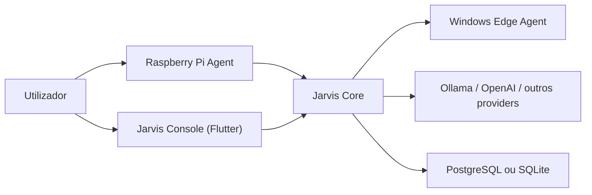

# Plano De Refactor Da Arquitetura

Estado proposto em 2026-05-02.

Este documento descreve a arquitetura alvo para reduzir a latencia de ativacao do assistente, suportar dispositivos remotos como Raspberry Pi e centralizar toda a configuracao a partir da aplicacao principal.

## 1. Problema atual

Hoje o sistema funciona, mas tem tres fragilidades estruturais:

- A app Flutter participa diretamente na runtime do assistente e coordena o ciclo da wake word.
- O agente Windows e a app trocam eventos por HTTP com polling, o que aumenta a latencia.
- As configuracoes persistem em sitios diferentes e misturam estado de UI com memoria conversacional.

Consequencia pratica:

- Se a app estiver fechada, a experiencia de wake word deixa de ser confiavel.
- Se a app estiver minimizada, a ativacao continua dependente de varios saltos locais.
- Raspberry Pi, PC e telemovel nao partilham um modelo central de dispositivos e capacidades.

## 2. Objetivos

Esta arquitetura deve resolver quatro objetivos ao mesmo tempo:

1. Wake word residente e rapida, sem depender da app aberta.
2. Suporte nativo a multiplos dispositivos, incluindo Raspberry Pi.
3. Configuracao central feita a partir da app no computador.
4. Capacidade de um dispositivo ouvir e outro executar a acao, por exemplo o Raspberry Pi ouvir e o PC executar.

## 3. Arquitetura alvo

Separar o sistema em tres camadas:

- `jarvis_console`: app Flutter para configuracao, chat, logs e monitorizacao.
- `jarvis_core`: backend central para identidade, estado, memoria, automacao, LLM e orquestracao.
- `jarvis_edge_agents`: agentes residentes por dispositivo para wake word, audio local e execucao de capacidades.

Diagrama alvo:



Leitura pratica:

1. O dispositivo que esta a ouvir localmente deteta a wake word.
2. Esse dispositivo capta o audio do pedido.
3. O `jarvis_core` decide a intencao e escolhe o dispositivo executor.
4. O agente executor corre a acao e devolve o resultado.
5. O dispositivo de audio recebe a resposta final e reproduz o TTS.

## 4. Nova estrutura do monorepo

Estrutura recomendada:

```text
jarvis_project/
  apps/
    jarvis_console/
  services/
    jarvis_core/
  agents/
    edge_agent_windows/
    edge_agent_pi/
  packages/
    shared_schemas/
    shared_client/
  docs/
    architecture/
```

Mapeamento a partir da estrutura atual:

- `jarvis_flutter` -> `apps/jarvis_console`
- `jarvis_backend` -> `services/jarvis_core`
- `jarvis_agent_windows` -> `agents/edge_agent_windows`

## 5. Responsabilidades por modulo

### 5.1 `jarvis_console`

Deve deixar de coordenar runtime de wake word ou audio local de longa duracao.

Responsabilidades:

- configuracao de dispositivos;
- visualizacao de estado;
- chat por texto;
- gestao de automacoes;
- escolha de dispositivo preferido para ouvir, falar e executar;
- logs e diagnostico;
- onboarding e emparelhamento de agentes.

Nao deve fazer:

- polling continuo de eventos de wake word;
- ser obrigatoria para o assistente arrancar;
- decidir localmente para que maquina vai uma acao.

### 5.2 `jarvis_core`

Passa a ser o ponto central de controlo.

Responsabilidades:

- autenticacao e registo de dispositivos;
- memoria e preferencias persistentes;
- LLM, STT, TTS e roteamento de providers;
- diretorio de capacidades dos agentes;
- orquestracao de comandos entre dispositivos;
- automacoes e rotinas;
- event log e auditoria.

### 5.3 `edge_agent_windows`

Responsabilidades:

- controlo do desktop Windows;
- captura de ecra;
- notificacoes locais;
- opcionalmente audio local se o PC tambem for ponto de interacao;
- ligacao persistente ao `jarvis_core`.

### 5.4 `edge_agent_pi`

Responsabilidades:

- wake word sempre ativa;
- captura de audio local;
- reproducao local de audio;
- botao fisico ou LED, se quiseres no futuro;
- ligacao persistente ao `jarvis_core`.

## 6. Protocolo entre core e agentes

Nao recomendo manter polling HTTP para eventos frequentes. A melhor base para o teu caso e:

- HTTP para configuracao, bootstrap e APIs da consola;
- WebSocket persistente para eventos e comandos entre `jarvis_core` e `edge_agents`.

Alternativa:

- MQTT tambem serve muito bem, sobretudo se fores crescer para varios dispositivos IoT.
- Para a fase atual, WebSocket e mais simples porque aproveita melhor o teu backend FastAPI.

### 6.1 Fluxo de ligacao do agente

1. O agente arranca como servico do sistema.
2. Autentica-se no `jarvis_core`.
3. Abre um WebSocket persistente.
4. Regista capacidades e estado.
5. Recebe comandos e envia eventos pela mesma ligacao.

### 6.2 Mensagens minimas

`agent.hello`

```json
{
  "type": "agent.hello",
  "device_id": "pc-windows-01",
  "device_type": "windows",
  "agent_version": "1.0.0",
  "capabilities": [
    "desktop.control",
    "screen.capture"
  ]
}
```

`agent.event.wake_word_detected`

```json
{
  "type": "agent.event.wake_word_detected",
  "device_id": "pi-sala",
  "wake_word": "jarvis",
  "timestamp": "2026-05-02T11:00:00Z"
}
```

`core.command.run_action`

```json
{
  "type": "core.command.run_action",
  "request_id": "req_123",
  "target_device_id": "pc-windows-01",
  "action": {
    "name": "open_app",
    "arguments": {
      "app_name": "spotify"
    }
  }
}
```

`agent.result.action_completed`

```json
{
  "type": "agent.result.action_completed",
  "request_id": "req_123",
  "device_id": "pc-windows-01",
  "ok": true,
  "result": {
    "app": "spotify"
  }
}
```

## 7. Modelo de dados minimo

As configuracoes nao devem viver em memoria conversacional. Devem passar para entidades explicitas.

Tabelas minimas:

- `users`
- `devices`
- `device_tokens`
- `device_capabilities`
- `device_presence`
- `device_settings`
- `assistant_profiles`
- `automation_rules`
- `conversation_sessions`
- `event_log`

Campos importantes em `devices`:

- `device_id`
- `name`
- `device_type`
- `location`
- `is_active`
- `last_seen_at`
- `preferred_for_wake_word`
- `preferred_for_tts`
- `preferred_for_desktop_control`

Exemplo pratico:

- `pi-sala` pode ter `preferred_for_wake_word = true`
- `pc-escritorio` pode ter `preferred_for_desktop_control = true`

Assim o sistema sabe:

- quem ouve;
- quem responde em voz;
- quem executa a acao.

## 8. Wake word e audio

### 8.1 O que mudar

Hoje a wake word usa uma abordagem demasiado pesada para deteccao continua. `Whisper` e bom para transcrever, nao para keyword spotting residente.

Recomendacao:

- wake word: `openWakeWord` ou `Porcupine`
- VAD local: manter conceito atual
- STT do comando: OpenAI ou `faster-whisper`

### 8.2 Pipeline recomendado

1. O agente local fica sempre a ouvir com um motor leve de wake word.
2. Ao detetar, liga imediatamente a captura do comando.
3. O audio do comando segue para o `jarvis_core`.
4. O `jarvis_core` decide se transcreve localmente ou remotamente.

### 8.3 Roteamento de audio

Deves suportar dois modos:

- `capture_and_transcribe_on_agent`
- `capture_on_agent_transcribe_on_core`

Para Raspberry Pi, o segundo modo costuma ser mais simples ao inicio:

- o Pi grava;
- envia WAV/PCM para o core;
- o core trata da transcricao.

## 9. Controlo cruzado entre Raspberry Pi e PC

Este e o caso que motivou a arquitetura nova.

Fluxo recomendado:

1. O utilizador fala com o Raspberry Pi.
2. O Pi envia o pedido ao core.
3. O core classifica a intencao.
4. O core escolhe o agente Windows como executor.
5. O Windows executa.
6. O core responde ao Pi com o texto e o TTS.

Isto exige:

- identidade unica por dispositivo;
- lista de capacidades por dispositivo;
- politica de roteamento.

Politica minima:

- um dispositivo pode ser `listener`;
- outro pode ser `executor`;
- outro pode ser `speaker`.

No inicio, podes simplificar:

- Raspberry Pi = `listener` e `speaker`
- PC = `executor`

## 10. Mudancas recomendadas no codigo atual

### 10.1 No Flutter

Remover gradualmente a responsabilidade de runtime que hoje esta em:

- `jarvis_flutter/lib/services/assistant_runtime_service.dart`
- `jarvis_flutter/lib/services/wake_word_service.dart`
- `jarvis_flutter/lib/services/voice_service.dart`

O objetivo e:

- manter captura manual por toque no microfone na consola, se quiseres;
- retirar da app o papel de motor residente da assistencia.

### 10.2 No backend atual

O backend atual ja e o melhor candidato para evoluir para `jarvis_core`, mas precisa de novas fronteiras:

- separar API da consola de API dos agentes;
- criar modulo de `device_registry`;
- criar modulo de `agent_gateway` com WebSocket;
- mover `settings` para persistencia propria;
- manter `assistant.service` como nucleo de orquestracao de intents.

### 10.3 No agente Windows

O `jarvis_agent_windows/agent.py` deve deixar de ser so um HTTP server de acoes locais e passar a servico residente:

- arranque automatico;
- reconexao ao core;
- anuncio de capacidades;
- execucao de comandos recebidos;
- emissao de estado e eventos.

## 11. Sequencia de migracao sem partir o sistema

### Fase 1. Consolidar fronteiras sem mudar UX

Objetivo:

- preparar o codigo para a nova arquitetura sem reescrever tudo.

Passos:

1. Introduzir `packages/shared_schemas`.
2. Definir modelos comuns para `device`, `capability`, `command`, `event`.
3. Extrair configuracoes da memoria conversacional para armazenamento proprio no backend.
4. Manter os endpoints atuais para compatibilidade.

Resultado:

- o sistema continua a funcionar como hoje, mas ja tem contratos corretos.

### Fase 2. Criar canal persistente com agentes

Objetivo:

- retirar polling e preparar agentes residentes.

Passos:

1. Criar WebSocket `/agents/connect` no core.
2. Ensinar o agente Windows a autenticar-se e manter sessao persistente.
3. Continuar a expor `/action` temporariamente como fallback.
4. Fazer a consola ler estado dos dispositivos a partir do core e nao diretamente do agente.

Resultado:

- menos latencia;
- topologia centralizada.

### Fase 3. Tirar wake word da app Flutter

Objetivo:

- fazer com que o assistente acorde sem depender da consola.

Passos:

1. Mover wake word para o agente Windows como servico residente.
2. Remover polling da app.
3. Fazer a app mostrar apenas estado do agente e configuracao da wake word.

Resultado:

- app fechada deixa de ser problema.

### Fase 4. Criar `edge_agent_pi`

Objetivo:

- suportar Raspberry Pi como listener e speaker.

Passos:

1. Reutilizar os contratos de agente ja definidos.
2. Implementar audio local e wake word no Pi.
3. Registar o Pi no core.
4. Permitir atribuir o PC como executor preferido.

Resultado:

- "Jarvis no Raspberry Pi a controlar o PC" passa a ser nativo.

### Fase 5. Limpeza final

Objetivo:

- remover caminhos legados.

Passos:

1. Descontinuar endpoints de wake word usados pela app.
2. Remover estado duplicado em ficheiros locais da consola.
3. Mover a consola para papel de administracao e chat.
4. Rever naming dos modulos para refletir `core`, `console` e `agents`.

## 12. Prioridades tecnicas

Se fores atacar isto com foco em impacto, a ordem certa e:

1. remover dependencia da app para wake word;
2. introduzir registo central de dispositivos;
3. trocar polling por ligacao persistente;
4. separar configuracao de memoria;
5. adicionar Raspberry Pi.

Se trocares a ordem e tentares primeiro "meter Raspberry Pi", vais apenas duplicar a arquitetura atual em mais um dispositivo.

## 13. Recomendacao final

A melhor forma de fazer isto nao e ter "uma app que fala com tudo". E ter:

- um `core` central com estado, configuracao e decisao;
- um agente residente por dispositivo;
- uma consola de gestao para administrar tudo.

Para o teu caso, a implementacao mais pragmatica e:

- manter FastAPI no core;
- usar WebSocket para agentes;
- manter Flutter como consola;
- criar primeiro o servico residente no Windows;
- depois criar o agente Raspberry Pi com o mesmo protocolo.

## 14. Proximo passo recomendado no codigo

O proximo passo mais seguro e de maior retorno e este:

1. introduzir o conceito de `device registry` no backend;
2. criar um WebSocket simples para ligacao do agente Windows;
3. adaptar o agente Windows para anunciar `desktop.control` e `screen.capture`;
4. fazer a app mostrar "dispositivos ligados" e configuracoes centrais.

So depois disso vale a pena mexer no pipeline de Raspberry Pi.
